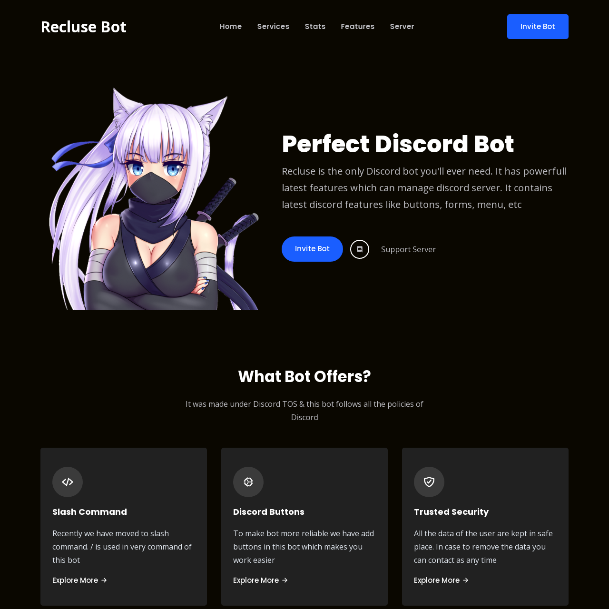
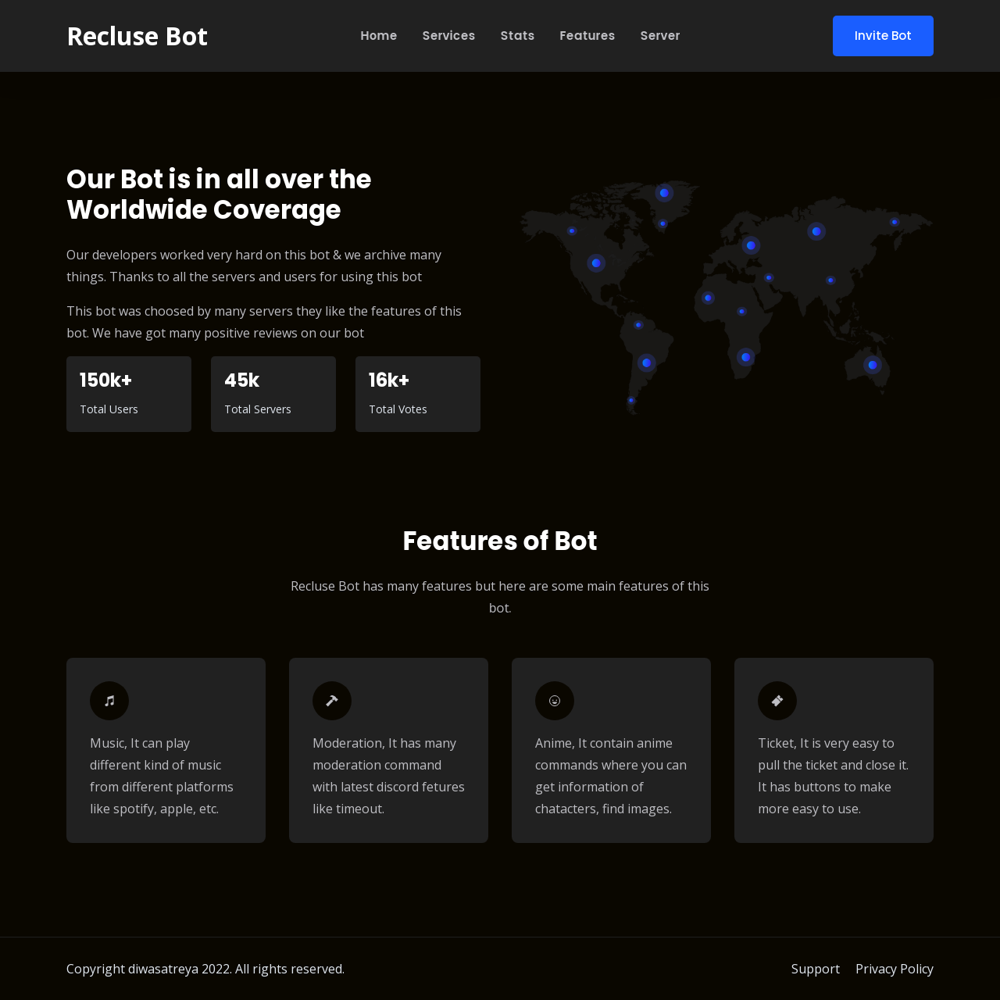

<div align="center">
  <br>

  <h3> Star the Project + Follow me on github </h3>

 
 </div>
           

# Information

- Watch the video carefully for instalizaion
- You can read the `README.md` file for configration
- This code can be made any anyone who is poor in coding
- If any coding help need then open the issue [ Dont ask coding help of this code in server ]
- Last thing make sure to star & fork this repo


### Replit
[](https://repl.it/github/diwasatreya/DiscordBot-Website)

## Configration

- No need to add any token of discord just fill the `config.json`
```js
{
  "port": "", // server port
  "name": "", // bot name
  "description": "", // short bot description
  "invite": "", // bot invite link
  "support": "", // bot support server
  "pfp": "", // bot profile link
  "feature1": "", // bot feature 1
  "feature2": "", // ""   "" ""  2
  "feature3": "", // ""   "" ""  3
  "feature4": ""  // ""   "" ""  4
}
```
- Footer: Goto `/views/index.ejs` line 419

### Profile Picture
- If you want image in circle then add `style="border-radius:50%"` in `/views/index.ejs` line  126


### URL ShortCut
- Goto `index.js` line 23 there you will code of url shortner.
- EX: yourdomain.com/discord then it will redirect you to your server
- If you want to add more the use this code
```js
app.get('/name after domain', async (req, res) => {
    res.redirect(`link to go`)
});
```

### Website Preview





#### More Code Info
- This is `nodejs` code. It can be run in html code also for that open issue & ask help. If you are developer you know how to do it.

### Need help?
If you need help! Feel free to join our [Support server](https://aromaxdev.xyz/discord)
